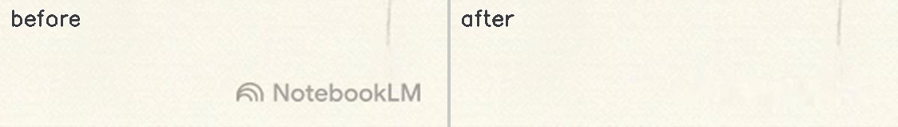
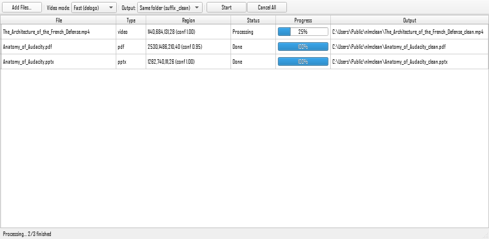

# nlmclean - NotebookLM Watermark Remover

Remove the NotebookLM watermark from exported **MP4 videos**, **PDFs**, **PPTX slide decks**,
and **PNG/JPG images** - fully locally, nothing is uploaded anywhere.

> **Disclaimer:** This project is not affiliated with or endorsed by Google.
> NotebookLM is a trademark of Google LLC. Only use this tool on content you have
> the right to modify.



Removal is stroke-precise: only the watermark's own pixels are touched
(verified bit-identical elsewhere for PDF/PPTX), so nothing around it gets
blurred or smudged.

## Features

- **Video** (the bit other tools don't do): two modes -
  *Fast* (ffmpeg `delogo`, near-instant) and *Quality* (per-frame OpenCV inpainting
  with a static-slide cache, audio preserved)
- **Universal video mode**: removes *any* static burned-in watermark, not just
  NotebookLM's - it finds the overlay by comparing frames over time (needs
  moving footage; a manual region selector covers the rest)
- **PDF**: removes the watermark object or inpaints it out of the page image
- **PPTX**: cleans the slide images in place; nothing else in the deck is touched
- **Images**: PNG / JPG / WEBP - including the **Gemini sparkle** watermark on
  AI-generated photos and infographics
- **Metadata stripping** (optional): EXIF, PDF info/XMP, PPTX document
  properties, video container tags
- Desktop GUI with drag-and-drop batch processing, an output window with a
  built-in preview/player, plus a full CLI
- Automatic watermark detection with manual region override



## Install

Prebuilt builds are on the [GitHub Releases](https://github.com/alpinist-GH/notebooklm-watermark-remover/releases)
page - no Python or ffmpeg to install, everything is bundled.

**Windows**

- *Installer (recommended):* download `nlmclean-<version>-windows-setup.exe`, run it,
  and follow the prompts. It installs to Program Files, adds a Start Menu shortcut
  (and an optional desktop icon), and registers an uninstaller in *Add or Remove
  Programs*. SmartScreen may warn because the installer is unsigned - choose
  *More info -> Run anyway*.
- *Portable:* download `nlmclean-<version>-windows-x64.zip`, unzip anywhere, and
  run `nlmclean.exe` - no installation.

**macOS**

- Download `nlmclean-<version>-macos-intel.dmg`, open it, and drag **nlmclean**
  to Applications. It's an Intel (x86_64) build but runs on Apple Silicon too
  via Rosetta, so it works on every Mac.
- The app is ad-hoc signed, so the first launch is blocked by Gatekeeper:
  right-click the app -> **Open** -> **Open**.

From source:

```sh
pip install -e .
nlmclean --help        # CLI
nlmclean-gui           # GUI
```

ffmpeg is bundled in releases; from source it is picked up from `imageio-ffmpeg`
or your PATH.

## CLI usage

```sh
nlmclean video.mp4                       # fast mode, writes video_clean.mp4
nlmclean video.mp4 --mode quality        # per-frame inpainting
nlmclean deck.pdf slides.pptx img.png    # batch, any mix of formats
nlmclean video.mp4 --region 1240,850,200,60   # explicit watermark rect
nlmclean any_video.mp4 --detect universal     # remove any static watermark
nlmclean photo.png --strip-metadata           # also drop EXIF/metadata
```

## License

MIT. Release bundles include a GPL build of ffmpeg invoked as a separate
process - see `LICENSE.ffmpeg.txt` in the bundle for its license and source link.
